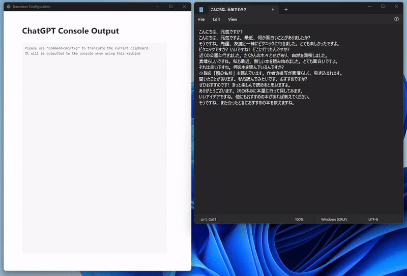

# Mipy
Mipy is a user-friendly Electron application designed to facilitate text translation using ChatGPT, with a specific emphasis on manga translations. With Mipy, you can easily provide examples to ChatGPT, which is particularly useful when you want to maintain the speech style found in manga or novels.

# Features
Translation: Mipy utilizes the powerful ChatGPT language model to provide accurate and context-aware translations for your text.

Optional Example Translations: By providing examples, you can guide ChatGPT to generate translations that align with the desired speech style commonly found in manga and novels.

# Why use this over a normal ChatGPT window?
Well, this program was really just made to suit my needs for translating manga with ChatGPT fast, using an OCR program you can scan in a page, and in one click have it translate it. With an optional output to a discord channel using a webhook url this makes it super speedy to scan in a page, use the keybind, and then scan the next.

## The Main Window

## Translating Text

# Getting Started
To use Mipy, follow these steps:

Clone the Mipy repository to your local machine.
Fill out the config located in `Mipy/config/example.env` with your ChatGPT Access Token, and a API reverse proxy URL, one is provided in the config, however this may cease to work down the line.
Install the required dependencies by running `npm install` in the project directory.
Start the application by running `npm start`.

If you want to improve the translation results, you can include examples that reflect the desired speech style of manga or novels.

Happy translating with Mipy!
